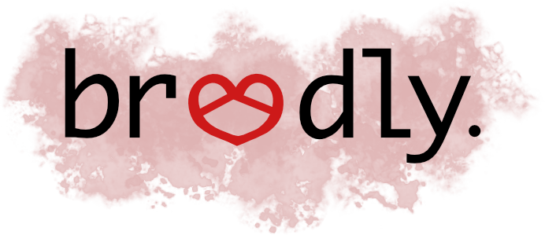

## The what 
Breedly is a personal blog feed reading site for singles with blogs.

## The what specifically
Users can:

- [ ] Sign up 
- [ ] Sign in
- [ ] Provide or update a link to their own blog
- [ ] Select topics they're interested in
- [ ] Select age ranges that they're interested in
- [ ] Subscribe to another user's blog
- [ ] Select a user that they are interested in
- [ ] Send and recieve messages
- [ ] Recieve loveNudge notifications when there is a mutual interest
- [ ] Delete their account once they get married

## Wireframes
[check em' out](./docs/views.md)

## The timeline

### Phase I: User Auth, Schema  ~1 day

- User authentication and sessions
- HTML forms for sign in/up
- Create the feeds model
- Deploy to Heroku

[Details](./docs/phase_one.md)

### Phase II: Add user feeds and basic user show ~2 days

- add basic json views for the feeds index and show
- backbone feed logic
- add interest and topic models 
- seed with users and feeds to test the functionality
 
[Details](./docs/phase_two.md)

### Phase III: Comparator for generating feeds ~1 day

- User's will have a feed index that is generated according to their preferences
- This will be done primarily on the back end (the filtering and sorting logic)

[Details](./docs/phase_three.md)

### Phase IV: Messaging and Notifications ~1 day

- Create a message model
- These will be organized into conversations and provided as json by the message index using the `current_user`
messages association

[Details](./docs/phase_four.md)

### Phase V: User interests
- create a `user_interest` model
- user's can click to generate a user interest
- database will check for mutual interests

[Details](./docs/phase_five.md)

### Phase VI: Stylin'
- change update user settings to a modal view
- make sure there are navigation buttons where necessary
- maybe include bootstrap

### Bonus

- Allow user's to specify a location in their own settings and note a maximum distance from which to generate other user feeds
- user subscriptions to other feeds to have them included no matter what, separate from their normal feed index
- create about us, help, contact us pages for the footer
- Additional points may be given to the compatibility score if a user has indicated an interested in the user who is having the feeds generated
- Implement a cap on the number of feeds provided, allow a refresh button from backbone as well as a more feeds button
    - This will request the next 100 (or whatever the cap is) number of sorted feeds from the database
- Users can block other user's messages